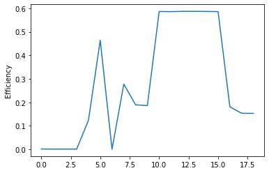

# Application Scenario

This document describes the target deployment, that is being scaled up and down, 
as well as the data that both approaches (i.e., reactive and proactive) are using.

Both components are deployed in Kubernetes and the respective YAML files are located in the `deployment` folder (i.e., `2-data-exporter-deployment.yaml`, `3-pause-deployment.yaml`).
The demo does not use real life data coming from the system but re-uses a very small subset of [Google cluster data (2011)](https://research.google/tools/datasets/cluster-workload-traces/).

## Target deployment

The target deployment is simply a container that indefinitely waits.
We use the `gcr.io/google_containers/pause:latest` image.
Therefore, we feed Prometheus data from an additional dataset to simulate real world resource usage.

## Resource usage

Our demo components are scaling based on resource data and the calculated Efficiency (`desired resources`/`used resources`).
To this end, we simulate the resource usage of the cluster by deploying a metric exporter that feeds Prometheus a subset of the Google cluster data repeatedly.
The specific subset of data can be found [in this file](https://github.com/polaris-slo-cloud/polaris-slo-framework/blob/master/python/exporters/csvreader/data/demo.csv).
Note, that referenced data already contains the Efficiency as column.
The exporter reads data from this csv file and returns after each scrape the next row and starts from the beginning upon reading all of it.

The following plot depicts the Efficiency over the whole subset (the x-axis is the index):

The resource efficiency shows how efficient the system is in using the allocated resources.
That means, an efficiency of 0% is wasting resources (i.e., allocated resources are not used), while 100% says that all allocated are used and nothing wasted.
Intuitively the system should target 100% but this could lead to problems in terms of performance.
The resource efficiency is not enough to identify bottlenecks caused by resource exhaustion and therefore another metric (i.e., execution latency) is necessary.

The demo scaling component is not using any performance related metric but simply employs a threshold-based scaling to balance the resource efficiency to avoid wasting too much but also avoid bottleneck issues.

Please note, that the demo scaling components expect values between 0 and 100, whereas the dataset is between 0 and 1.
The reactive approach simply multiplies the number by 100, while the proactive approach multiplies the final inference result of the AI service by 100.

## Polaris Load Simulator

The [data-exporter application](https://github.com/polaris-slo-cloud/polaris-slo-framework/tree/master/python/exporters/csvreader/exporter) acts as our load simulator.
Its purpose is to read from a `csv` file and being scraped by Prometheus.
The load simulator returns per scrape one row and starts to read the file again from the beginning.
Therefore, the application will cycle continuously over the csv file that is contained in the container.
At the moment, it only supports the [columns](https://github.com/polaris-slo-cloud/polaris-slo-framework/blob/master/python/exporters/csvreader/exporter/csvreader.py#L114) defined for our resource efficiency model and the csv file has to be included during container build time.

During the demo application the efficiency (and its corresponding low level metrics) are repeatedly returned to Prometheus indefinitely.
